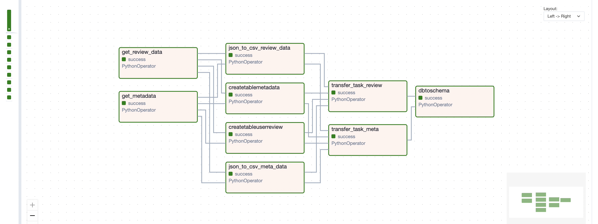
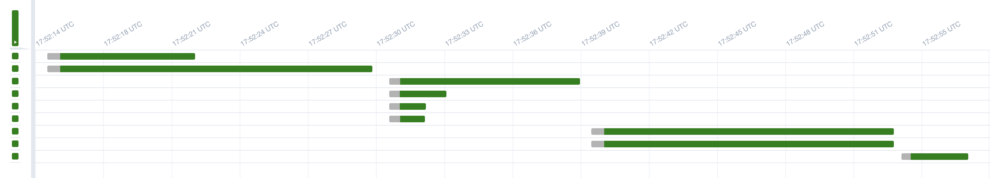
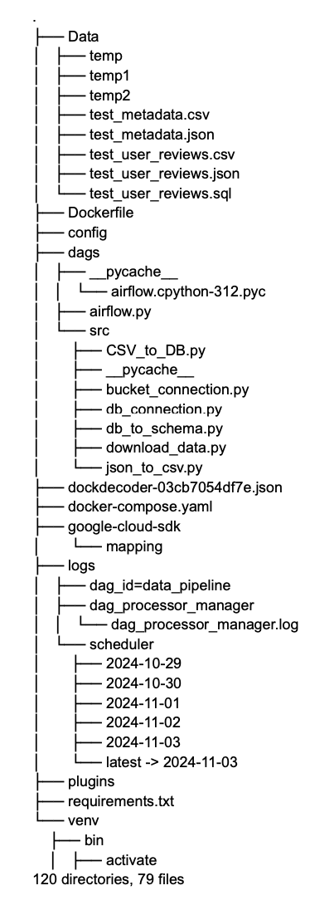

## Setting Up Your Development Environment
For an efficient development experience, please follow these two essential steps:
### 1. Downloading the Repository
To download this repository, use the following commands depending on your operating system.
### On Mac
Open a terminal and run:
```bash
git clone git@github.com:eCom-dev5/eCom-Chatbot-Data-pipeline.git
```

### On Windows
Open a terminal and run:
```bash
git clone https://github.com/eCom-dev5/eCom-Chatbot-Data-pipeline.git
```
This will create a local copy of the repository on your machine.

### 2. Install the Virtual Environment
First, create an isolated environment to house your project dependencies. Execute the following commands:

```bash
# For Windows
python -m venv venv
# For macOS and Linux
python3 -m venv venv
```

### 3. Install All Required Libraries
Next, activate your virtual environment and install the necessary libraries in one swift command:

```bash
# For Windows
.\venv\Scripts\activate
# For macOS and Linux
source venv/bin/activate
# Install all dependencies
pip install -r requirements.txt
```

### 4. Storing API keys and other secret keys
To securely store your API keys and other sensitive information, you should create a `.env` file. 
Follow these steps:

```bash
# In the root directory of your project, create a new file named `.env`:
touch .env
```
```bash
#Open the `.env` file in your favorite text editor and add your API keys in the following format:
API_KEY=<your-api-key-here>
```
Cover the following in your .env file: AIRFLOW_UID, DB_USER, DB_PASS, DB_NAME, INSTANCE_CONNECTION_NAME, GOOGLE_APPLICATION_CREDENTIALS, GCS_BUCKET_NAME, postgres_conn_string


### 5. Generating a GCP JSON Connection File
To generate a JSON connection file for Google Cloud Platform (GCP), follow these steps:
1. Access Credentials:
   - Navigate to Credentials in the Google Cloud Console.
2. Create a Service Account:
   - Click on Create Credentials and select Service Account.
3. Assign a Role:
   - Choose the Viewer role for the Service Account, then click Done.
4. Generate JSON Key:
   - Locate your newly created Service Account.
   - Click on Keys.
   - Select Add Key, then choose JSON.
   - Save the generated JSON file securely.
5. Store the JSON File:
   - Place the JSON file in the main directory of your project.

### 6. Steps for Setting Up Google Cloud SDK in Your Environment
1. Install Google Cloud SDK:
   - Download the SDK based on your operating system:
   - Linux: Use the curl command.
   - Mac: Use curl or brew if you have Homebrew installed.
   - Windows: Download the installer from the Google Cloud website.
```bash
# For Linux/MacOS
curl -O https://dl.google.com/dl/cloudsdk/channels/rapid/downloads/google-cloud-sdk-<VERSION>-<OS>.tar.gz
tar -xf google-cloud-sdk-<VERSION>-<OS>.tar.gz
./google-cloud-sdk/install.sh
```
2. Initialize the SDK:
```bash
gcloud init
```
3. Authenticate Google Cloud SDK:
   - Set up a service account and download its JSON key file.
   - Use the following command to authenticate with this key:
```bash
gcloud auth activate-service-account --key-file=<path-to-your-service-account-key>.json
```
4. Set Environment Variables:
   - Define environment variables to streamline interaction with Google Cloud.
```bash
export GOOGLE_CLOUD_PROJECT=<your-project-id>
export GOOGLE_APPLICATION_CREDENTIALS="<path-to-your-service-account-key>.json"
```
5. Enable Required APIs
   - Enable Compute Engine, Cloud-SQL and Cloud SQL Admin APIs
```bash
gcloud services enable <API_NAME>
```
6. Verify Installation:
   - Run a few commands to confirm that the SDK is set up correctly:
```bash
gcloud --version
gcloud config list
gcloud auth list
```
After setting up google SDK, update the google SDK path in docker-compose.yaml


### 7. Set Up Docker
1. Download Docker:
   Go to the Docker website. Choose the appropriate Docker Desktop version for your operating system (Windows, Mac, or Linux).
2. Install Docker.
   Follow the installation instructions specific to your OS.
   - Windows: Run the installer and follow the prompts. Make sure to enable Windows Subsystem for Linux (WSL) if prompted.
   - Mac: Open the downloaded .dmg file, drag Docker to your Applications folder, and launch it.
   - Linux: Install Docker Engine by using commands specified in the Docker website.
  
3. Verify Installation:
   Run the following command to check if Docker is installed correctly:
```bash
docker --version
```

### 8. Set Up Email Notifications
1. Locate the airflow.cfg File
   Find the airflow.cfg file in your AIRFLOW_HOME directory.
2. Update the Following Fields
   Open the airflow.cfg file and update the email configuration settings as shown below:
   ```bash
   smtp_host = smtp.gmail.com
   smtp_user = <your gmail ID>
   smtp_password = <your Gmail authenticated app password>
   smtp_port = 587
   smtp_mail_from = <your gmail ID>
   ```
   - smtp_host: Set to smtp.gmail.com for Gmail SMTP.
   - smtp_user: Your full Gmail email address (e.g., youremail@gmail.com).
   - smtp_password: Your Gmail authenticated app password. Ensure you have enabled App Passwords in your Google account settings.
   - smtp_port: Use 587 
   - mtp_mail_from: Your Gmail email address (same as smtp_user).
   
  
### 9. Running Docker and Initializing Airflow
Once Docker is installed, follow these steps to set up and start Airflow with Docker Compose.
1. Start Docker Compose Services
   Run the following command to bring up all services defined in the `docker-compose.yml` file in detached mode (running in the background):
   ```bash
   docker compose up -d
   ```
   
2. Initialize Airflow
   Before using Airflow, run:
   ```bash
   docker compose up airflow-init
   ```
   This initializes Airflow by setting up the necessary configurations, database tables, and users. It ensures Airflow is ready for use.
   
4. Initialize the Airflow Database
   To set up the Airflow metadata database, run:
   ```bash
   airflow db init
   ```
   This command creates the required database tables for tracking tasks, DAG runs, logs, and other Airflow components. It's necessary to do this step once when setting up Airflow for the first time.

5. Apply Database Migrations
   To ensure your database schema is up-to-date with the latest version of Airflow, run:
   ```bash
   airflow db migrate
   ```

6. Start All Services
   Finally, run:
   ```bash
   docker compose up
   ```

This command brings up all services defined in docker-compose.yml in the foreground, so you can see real-time logs. If everything is configured correctly, Airflow will be available at 
   ```bash
http://0.0.0.0:8080/
   ```

## Dataset Information
### 1. About Dataset
The dataset we will be working with consists of reviews and metadata for video games and toys, sourced from a comprehensive collection of Amazon product reviews data that are recorded from May 1996 to September 2023. This data will help improve our eCommerce chatbot by giving it better insights into customer opinions and preferences, allowing it to answer questions with more relevant, context-specific information.

### 2. Data Card
We utilize two types of datasets;

**User Reviews Dataset**
| Feature Name       | Feature Data Type | Feature Description                          |
|--------------------|-------------------|----------------------------------------------|
| `rating`           | Float            | Rating of the product                        |
| `title`            | String           | Title of the user review                     |
| `text`             | String           | Text body of the user review                 |
| `images`           | List             | Images posted by user after they receive the product |
| `asin`             | String           | ID of the product                            |
| `parent_asin`      | String           | Parent ID of the product                     |
| `user_id`          | String           | ID of the reviewer                           |
| `timestamp`        | Integer          | Time of the review                           |
| `verified_purchase`| Boolean          | User purchase verification                   |
| `helpful_vote`     | Integer          | Helpful votes of the review                  |

**Product Metadata Dataset**
| Feature Name       | Feature Data Type | Feature Description                                           |
|--------------------|-------------------|----------------------------------------------------------------|
| `main_category`    | String            | Domain of the product                                          |
| `title`            | String            | Name of the product                                            |
| `average_rating`   | Float             | Rating of the product shown on the product page                |
| `rating_number`    | Integer           | Number of ratings for the product                              |
| `features`         | List              | Bullet-point format features of the product                    |
| `description`      | List              | Description of the product                                     |
| `price`            | Float             | Price in US dollars                                            |
| `images`           | List              | Images of the product                                          |
| `videos`           | List              | Videos of the product, including title and URL                 |
| `store`            | String            | Store name of the product                                      |
| `categories`       | List              | Hierarchical categories of the product                         |
| `details`          | Dictionary        | Product details, including materials, brand, sizes, etc.       |
| `parent_asin`      | String            | Parent ID of the product                                       |
| `bought_together`  | List              | Recommended bundles from the website                           |

### 3. Data Source
This dataset is taken from [UCSD - Amazon Product Reviews](https://cseweb.ucsd.edu/~jmcauley/datasets.html#amazon_reviews).

We employed Apache Airflow to modularized our data pipeline.






### 4. Data Pipeline Components

**download_data.py:** This code downloads the data from a specified URL, extract the contents and uploads the extracted file to a cloud storage bucket.

**bucket_connection.py:** This module is responsible for establishing a connection to the Google Cloud Storage bucket using environment variables. 

**json_to_csv.py:** This module downloads the JSON file from the cloud storage bucket, converts the JSON data to CSV format using pandas and uploads the CSV back to cloud storage.

**db_connection.py:** This module is essential for establishing a secure connection to a Google Cloud SQL database using the necessary configurations.

**CSV_to_DB.py:** It is responsible for creating the user review and metadata tables and uses Google Cloud CLI to import metadata CSV from GCS into the PostgreSQL tables.

**db_to_schema.py:** This module is responsible for cleaning the metadata table by removing invalid image URLs and splits metadata and user review tables into four different table.


## Folder Structure


